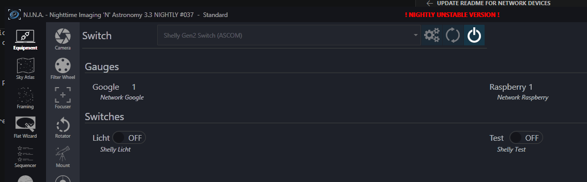
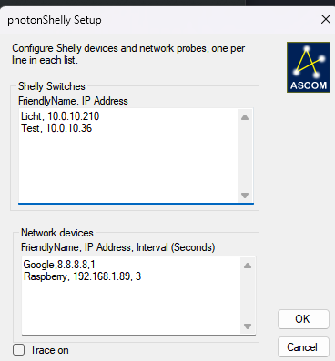

# ShellyASCOM

ASCOM Switch driver for Shelly devices.

## Features

- Supports multiple Shelly devices in one driver instance.
- Supports additional read-only network probe devices (sensors) in one driver instance.
- Supports **Shelly Gen1** and **Shelly Gen2** switch APIs.
- Automatically detects API generation per device and stores it in ASCOM Profile.
- Controls switch state (read/write) for relay channel `0`.

## Requirements

- ASCOM Platform 6.2 or higher

## Configuration

Open the ASCOM driver setup dialog and configure devices in both lists.

### Shelly Switches

Add one Shelly switch per line:

`FriendlyName,IPAddress`

Example:

`Observatory Roof,192.168.1.40`

`Power Strip,192.168.1.41`

### Network Devices (Sensors / Probes)

Add one network probe per line:

`FriendlyName,IPAddress,IntervalSeconds`

Examples:

`Roof Sensor,192.168.1.60,30`

`Weather Station,192.168.1.61,10`

Notes:

- At least one Shelly switch or network probe is required.
- Friendly name can be empty (IP will be used as display name).
- Network probes are read-only and report online/offline state using ICMP ping.
- `IntervalSeconds` must be a positive integer.

## Supported Devices

This driver supports Shelly devices that expose a **switch/relay channel 0** via:

- Gen1: `/relay/0`
- Gen2+: `Switch.GetStatus` / `Switch.Set` for `id=0`

Based on the vendor API documentation, supported device families include:

### Gen1 (relay/switch-capable families)

- Shelly 1 / 1PM
- Shelly 1L
- Shelly 2 / 2.5 (relay mode)
- Shelly 4Pro
- Shelly Plug / PlugS
- Shelly Uni
- Shelly EM
- Shelly 3EM

### Gen2+

- Shelly Gen2/Gen3/Plus/Pro devices that provide the **Switch** component on channel `0`.

### Network Devices (Sensors / Probes)

- Any network-reachable device that responds to ICMP ping.
- Intended for read-only presence/availability sensors represented as switch values:
	- `1` = reachable
	- `0` = unreachable

Notes:

- Sensor-only Shelly devices (e.g., motion, smoke, flood, door/window, etc.) are not controllable Shelly switch channels, but can be added as network probe sensors if they respond to ping.
- Multi-channel devices are currently controlled through channel `0`.

## ASCOM Conformance

Test passed with ASCOM Conformance Checker version, see protocol logs for details.

## API Endpoints Used

### Gen2

- Read: `/rpc/Switch.GetStatus?id=0`
- Write: `/rpc/Switch.Set?id=0&on=true|false`

### Gen1

- Read: `/relay/0`
- Write: `/relay/0?turn=on|off`

### Generation Detection

- Preferred: `/shelly` (uses `gen` when available)
- Fallback probing of Gen2/Gen1 switch endpoints

## Build

Build with Visual Studio (solution/project targets .NET Framework 4.7.2).

## Repository

- Main branch: `master`
- Remote: `origin` (`https://github.com/photon1503/ShellyASCOM`)
